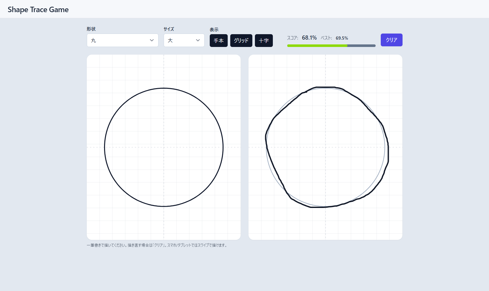
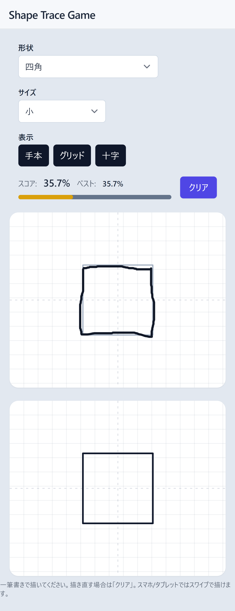

# Shape Trace Game

<p>
  <a href="https://seiya-matsuoka.github.io/shape-trace-game/"> 
    
  </a>
  <a href="https://github.com/seiya-matsuoka/shape-trace-game/actions/workflows/deploy.yml">
    
  </a>
</p>

<p>
  
  
  
</p>

**指定した図形にどれだけ似せて描けるか**を競うゲーム。  
マウス／タッチで**一筆書き**し、終点で自動採点（%）します。

## デモ

公開URL：https://seiya-matsuoka.github.io/shape-trace-game/

[](https://seiya-matsuoka.github.io/shape-trace-game/)

## スクリーンショット

<table>
  <tr>
    <td align="center">
      <br/>
      <sub>PC（左：見本 / 右：描画）</sub>
    </td>
    <td align="center">
      <br/>
      <sub>Mobile（上：描画 / 下：見本）</sub>
    </td>
  </tr>
</table>

## 特徴

- **図形**：丸 / 三角 / 四角 / 星 / 五角形 / ハート
- **サイズ**：大 / 小
- **表示**：手本（ゴースト） / グリッド / 十字の ON/OFF
- **採点**：一筆書き終了時に自動採点（IoU による類似度、0–100%）
- **ベストスコア保存**：`localStorage` に  
  → **図形** × **表示設定**（**手本/グリッド/十字**） 組み合わせごと（サイズは無視）
- **設定復元**：図形 / サイズ / 表示トグルは**起動時に復元**

## 使い方

1. **図形**と**サイズ**を選ぶ（必要なら表示ガイドをONに）
2. キャンバスで**一筆書き**する（指・マウスの離脱で自動採点）
3. さらに高スコアを狙うなら **クリア** して描き直し
   - ベストスコアは自動更新・表示されます

## セットアップ

```bash
npm i
npm run dev
```

- 本番ビルド：`npm run build`
- プレビュー：`npm run preview`

## ディレクトリ構成

```bash
src/
├─ main.ts       # エントリ（初期化・イベントバインド）
├─ app.ts        # アプリ本体（描画/採点/状態）
├─ guides.ts     # グリッド/十字の描画
├─ canvasUtil.ts # Canvas ・リサイズ
├─ score.ts      # 前処理（スムージング・リサンプル）/ IoU 採点
├─ storage.ts    # 設定/ベストスコアの保存・復元(localStorage)
├─ ui.ts         # スコアUI・トグル見た目
├─ shapes.ts     # お手本図形の生成
└─ style.css     # Tailwind レイヤ
```

## 技術スタック

- **TypeScript**（**Vite**）
- **Tailwind CSS v3**

## セキュリティ / プライバシー

- データはブラウザの `localStorage` を使用。
- クリア操作は**現在の描画とスコアのみ**を初期化し、設定やベストは保持します。

## デプロイ（GitHub Pages：ブランチ不要の Actions 方式）

- `vite.config.ts` の `base` を リポジトリ名に設定
- GitHub Actions（`deploy.yml`）が `main` への push で自動デプロイ

  [](https://github.com/seiya-matsuoka/shape-trace-game/actions/workflows/deploy.yml)
